# Reservation and Resource Management with Microservices

I developed this project with the goal of creating an application using a microservices architecture to handle resource reservations. In this setup, each reservation corresponds to a specific resource, and each resource is characterized by an ID, a name, and a type (MATERIEL_INFO, MATERIEL_AUDIO_VISUEL). Individuals initiate reservations, which are defined by an ID, a name, a context, a date, and a duration.
Each reservation is initiated by an individual, and a person is defined by an ID, a name, an email, and a role.

## Technical Architecture of the Project

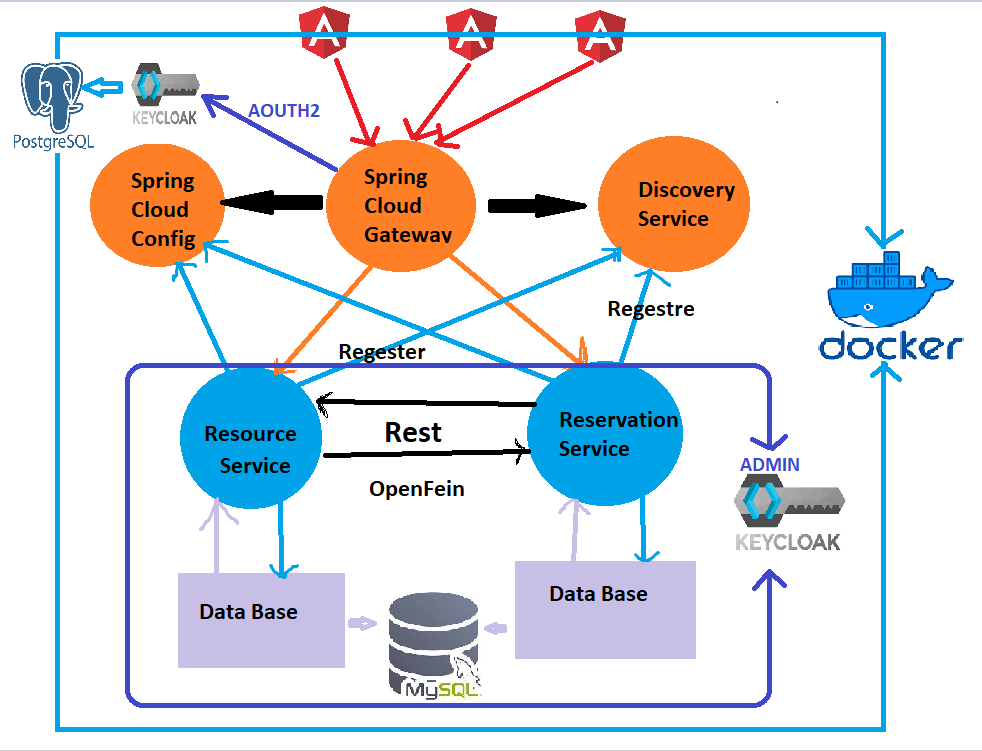<br>
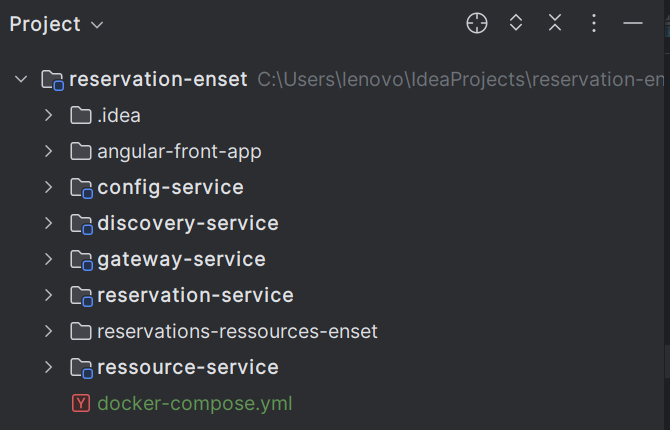<br>


The project consists of the following microservices:

1. **Resources-Service (Resource Management Microservice)**
   - Responsible for managing resources, including CRUD (Create, Read, Update, Delete) operations.
   - Uses Spring Boot with a DAO (Data Access Object) architecture, Service, DTO (Data Transfer Object), and a REST controller.

2. **Reservation-Service (Reservation Management Microservice)**
   - Manages reservations, including create, read, update, and delete operations.
   - Integrates with the Resources-Service microservice to retrieve information about resources.
   - Uses Feign Client for communication between microservices.

3. **Gateway-Service (Gateway Service)**
   - Based on Spring Cloud Gateway to route requests to the corresponding microservices.
   - Integrates with Eureka Server for service discovery.

4. **Discovery-Service (Discovery Microservice)**
   - Uses Eureka Server  for microservices discovery in the architecture.

5. **Config-Service (Configuration Microservice)**
   - Uses Spring Cloud Config for centralized configuration management.

6. **Angular-Front-App (Angular-based Frontend Application)**
   - Develops a user-friendly interface for viewing, creating, updating, and deleting reservations.
   - Secures the application with authentication based on Keycloak.

## Development and Testing of Microservices

- Microservices development includes configuring entities, services, REST controllers, Feign clients, and necessary configurations.

- Application security is implemented using Oauth2 and OIDC, with Keycloak as the identity provider.

- Unit and integration tests are conducted to ensure the reliability of microservices.

## Documentation Generation and Error Handling

- Utilizes OpenAPIDoc (Swagger) specification to generate RESTful services documentation.

## Deployment with Docker and Docker Compose

- Utilizes Docker and Docker Compose for easy deployment and management of containers.

# Installation and Execution Instructions

1. Clone the Git repository.

    ```bash
    git clone https://github.com/abdlkrim3/reservation-enset.git
    ```

2. Navigate to the project directory.

    ```bash
    cd reservation-enset
    ```

3. Configuring and deploying microservices and frontend application.

4. Run the services with Docker Compose.

    ```bash
    docker-compose up
    ```

5. Access the application via the browser at [http://localhost:8083].

    **Note:** Before accessing the application, ensure that Keycloak is properly configured. Follow the steps below:

    a. Configure Keycloak:
        - Install and run Keycloak.
        - Set up a new realm and configure the necessary settings.

    b. Create a Client:
        - Within your Keycloak realm, create a new client for your application.
        - Configure the client settings, such as the redirect URI.

    c. Add Users:
        - Create users in Keycloak and assign them to the appropriate roles.
        - Ensure that the roles align with the permissions required by your application.


6. Customize the application as needed and explore additional configuration options.

## Application Testing

1. Regestration interface:
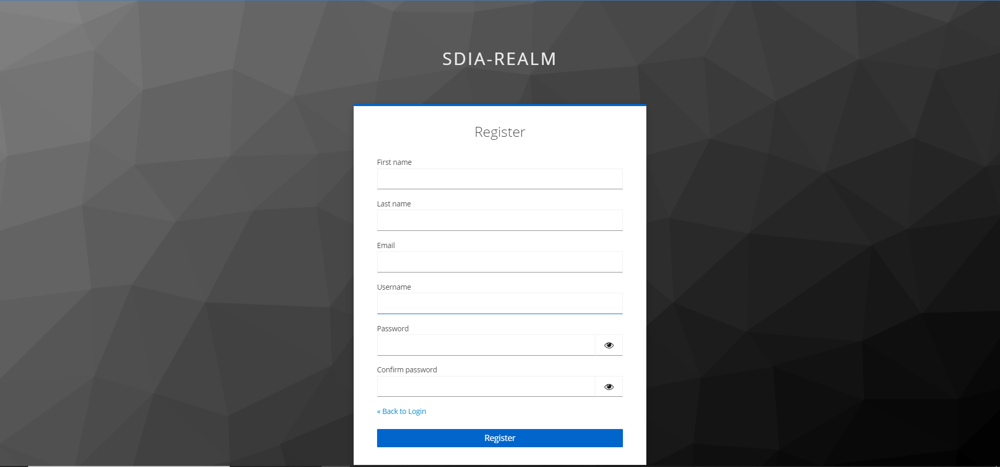<br>

2. Access the login interface:
   - Open your web browser.
   - Visit [http://localhost:port/login](http://localhost:port/login).

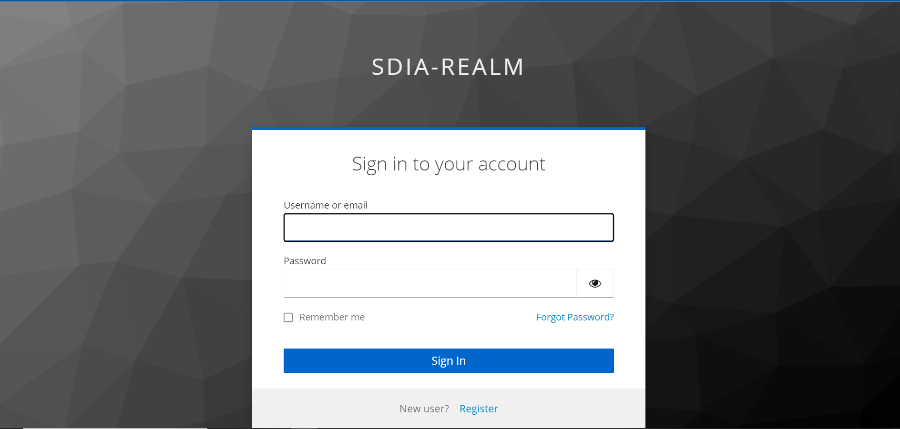<br>

   - Log in with user using  Keycloak credentials.

3. Access the user interface:
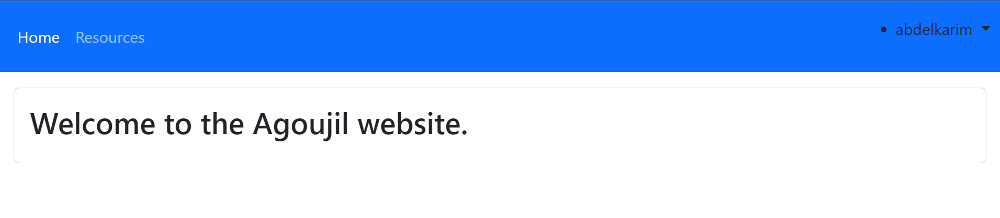<br>

4. Resource Management:
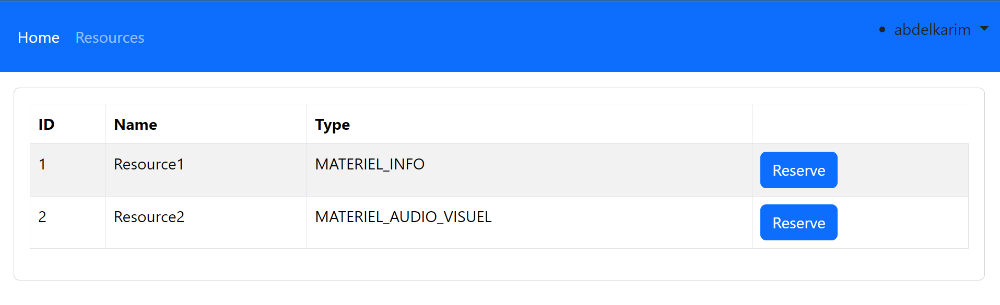<br>

5. Access the Admin login interface:
   - Open your web browser.
   - Visit [http://localhost:port/login](http://localhost:port/login).

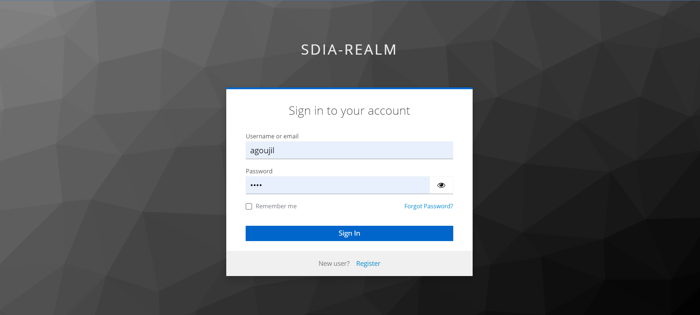<br>

   - Log in with Admin using  Keycloak credentials.

6. Access the Admin interface:
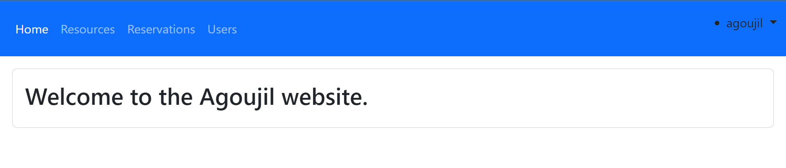<br>

7. Resource Management:
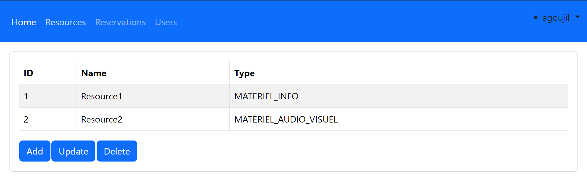<br>

8. Reservation Management:
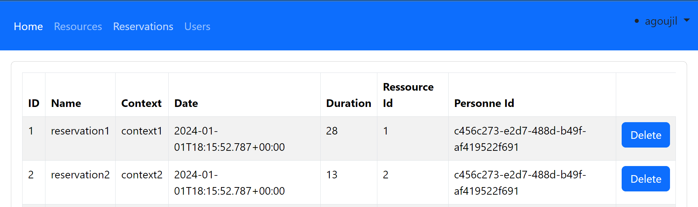<br>

9. Users Management:
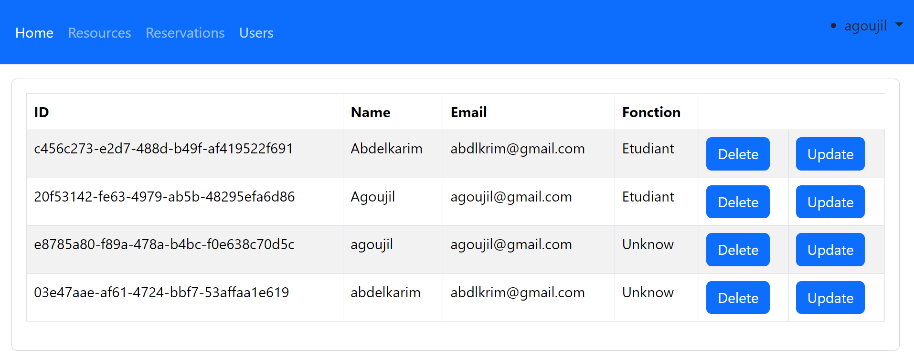<br>

